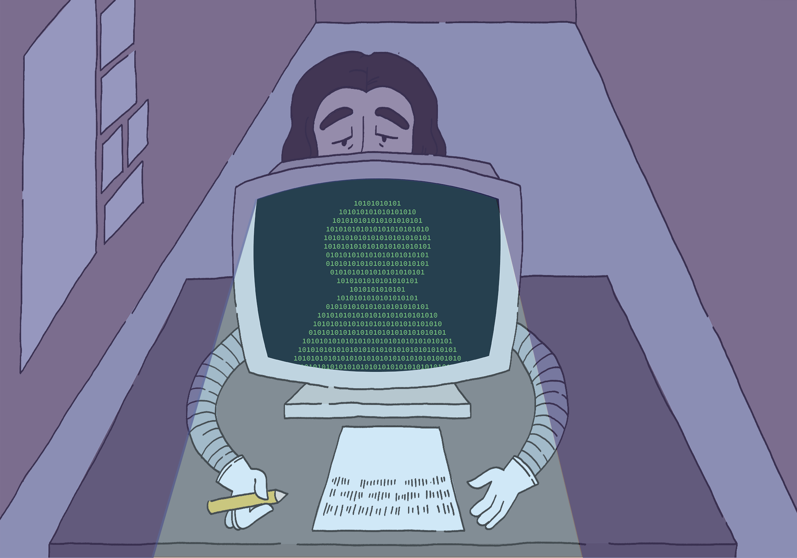

> "The student who is using it because they lack the expertise is exactly the student who is not ready to assess what it’s doing critically."
> - Chronicle of Higher Ed

## Introduction

AI is an undeniable part of everyday life that can’t be ignored. While I do use AI, specifically for computer science or math purposes, I personally try not to just blindly trust it. I try to think critically of what its answer means and what they’re saying. I personally used Gemini and Perplexity, both in different areas, during the course of ICS 314. 

## Personal Experience with AI

Since I’m taking the course asynchronously over the summer, the process for both felt more or less similar to each other. In the beginning, I tried to avoid using AI to complete these. However, with the amount of time recommended and them getting more and more difficult as the semester went on, it was becoming impossible to finish within a timely manner. I would mostly use Gemini for debugging certain things, especially with ESLint as it was very difficult to implement on Windows.

### Experience WODs/Practice WODs

Since I’m taking the course asynchronously over the summer, the process for both felt more or less similar to each other. In the beginning, I tried to avoid using AI to complete these. However, with the amount of time recommended and them getting more and more difficult as the semester went on, it was becoming impossible to finish within a timely manner. I would mostly use Gemini for debugging certain things, especially with ESLint as it was very difficult to implement on Windows.

### WODs

I would try the practice WODs over and over again, or at the very least really understand what each component did, before taking the WODs. For some of them, I didn’t use AI. For some of them, I did use AI, Gemini, but only for a few things. Using the practice WODs as a guide was very helpful in being able to be efficient.

### Essays

I didn’t use AI for anything relating to the essays in terms of concepts or proof-reading.

### Final Project

For the Final Project, I used Gemini to debug a lot of the errors that were happening, as well as reading and summarizing error messages as they would be extremely long. Sometimes, I would have it generate code in the sense of, “this is my code, can you please show me where the fix is within the code”, and things like that.

### Learning a Concept / Tutorials

I think that when using AI to learn a concept, it’s a good idea to have a critical eye, since AI can sometimes get things wrong. It’s good to actually digest what the AI is saying and think about why it’s saying it and whether it makes sense. If utilized well, AI can definitely help you learn better. However, it’s important to not just blindly trust anything. 

### Answering a question in class/Discord and Asking or Answering a Smart Question

I didn’t ask many questions on the Discord Server. For the questions I did ask, I didn’t use AI, as I’m pretty used to asking smart questions anyway, and for answering questions, I don’t use AI either.

### Coding example

I haven’t asked for a coding example from AI, although I have asked AI to debug things for me, so sometimes it will provide a “this isn’t working and why, this will work and why” comparison.

### Explaining Code

When I’m coding, I try to understand what’s happening within the code myself. While AI might answer why, I still try to make sure that the explanation makes sense and is logical. I also don’t necessarily parrot what it would say. I would try to think of the best way to explain it with my own words.

### Writing Code

When I’m coding, if it’s a relatively simple process, I try to code first and then use AI to debug, and once it’s de-bugged I try to really understand what’s going on and how it’s functioning. If it’s a relatively complex process, I would ask AI to generate the code for me first, but then I would look through the code myself and figure out what each part was meant to do. Then, I would ask questions if I had any, and read to the more in-depth explanation. If it didn’t make sense, I would point this out, and ask again keeping the error in mind.

### Documenting Code

I personally prefer to do this myself, as I feel that if you’d like to convey something to another human, it’s better if a human writes it themselves. There’s a certain style that I also like to keep as well, although I understand that it’s just a preference.

### Quality Assurance

This was honestly what I would use AI the most for, especially as some of the error messages would be so long and convoluted. Having AI break it down for me was very nice. I would try to double check that its explanation made sense though. In many ways, it was very helpful with this because it could easily identify causes and suggest fixes.

## Impact on Learning and Understanding

I feel like while AI can be a helpful tool for your learning, it’s unfortunately way too easy for most people to abuse. I’ll be honest, it was true even for myself this semester, especially towards the end. Even though I was trying my best to analyze each statement, I was frankly so busy (mostly with the project) that I was worried if I didn’t use it, I wouldn’t finish in time. But I’m not sure whether I understand everything completely. I think at the very least I understand most of what’s going on and what my parts of the code do. However, I do think that using AI has made my learning weaker. While I think I would be able to do all of these tasks again without AI, I think it would definitely be quite a slow process. I think the important thing that I learned is that it’s very tempting to use AI, and while I was already quite sympathetic towards students who use it in math (I was a Math Learning Assistant), I think I’ve deepened my sympathy, if not empathy for them. 

## Practical Applications

## Challenges and Opportunities

The greatest challenge of AI is making sure that it’s not a tool that you blindly trust to do everything for you and that you don’t ask the deeper questions of what things mean, how they work, and why they work. Many students fall into this trap in all kinds of fields. I think this course was definitely the closest that I have got to falling into that trap, just because of the time constraints of a summer class. However, this is true in all classes in all subjects. I can understand that critical thinking is hard, and doing it every day in many different subjects can feel exhausting. However, I think it’s important to continue this, as ultimately it’s an important part of life to be able to evaluate information and draw your own conclusions.

## Comparative Analysis

While I think that AI can help with learning, I also recognize that essentially, it’s mostly reliant on the User needing to ask more questions and pry for a deeper answer. I think encouraging AI use in introductory courses is a bad idea, as the people who are learning haven’t developed the subject maturity in order to understand what’s going on. As a Math Learning Assistant teaching Pre-Calculus, I generally proved my point about AI not being accurate by showing students how and why that’s not the answer and where the AI hallucinated. For one geometry problem, the AI literally invented points out of thin air. That example was more convincing to the students that it wasn’t very helpful, essentially because they didn’t know exactly what question to ask. For upper division level classes, for people who have an intuition about the basic concepts, I think it could potentially be more helpful. However, again, this is contingent on the user actually wanting to think critically. So, in my opinion, despite using AI decently well in some of my Math courses to understand certain topics and explanations better, I still think a traditional learning model is much better, even for upper division level classes (specifically classes that aren’t introducing anything considered the basics). 

## Future Considerations

I think AI in education is an extremely slippery slope. It allows for people to not think critically and not gain the knowledge that they need. This can truly set them back very far. While I don’t necessarily think AI itself is terrible, over-reliance on AI will cause a severe lapse in critical thinking and problem-solving skills.

## The Takeaway 

Overall, I think AI is complicated. I think people are complicated too. In today’s world where we try to learn things faster and faster. AI can feel like the thing that you need in order to just take a break. Sometimes it would be better for us to slow down and really learn and understand things in a traditional way.
