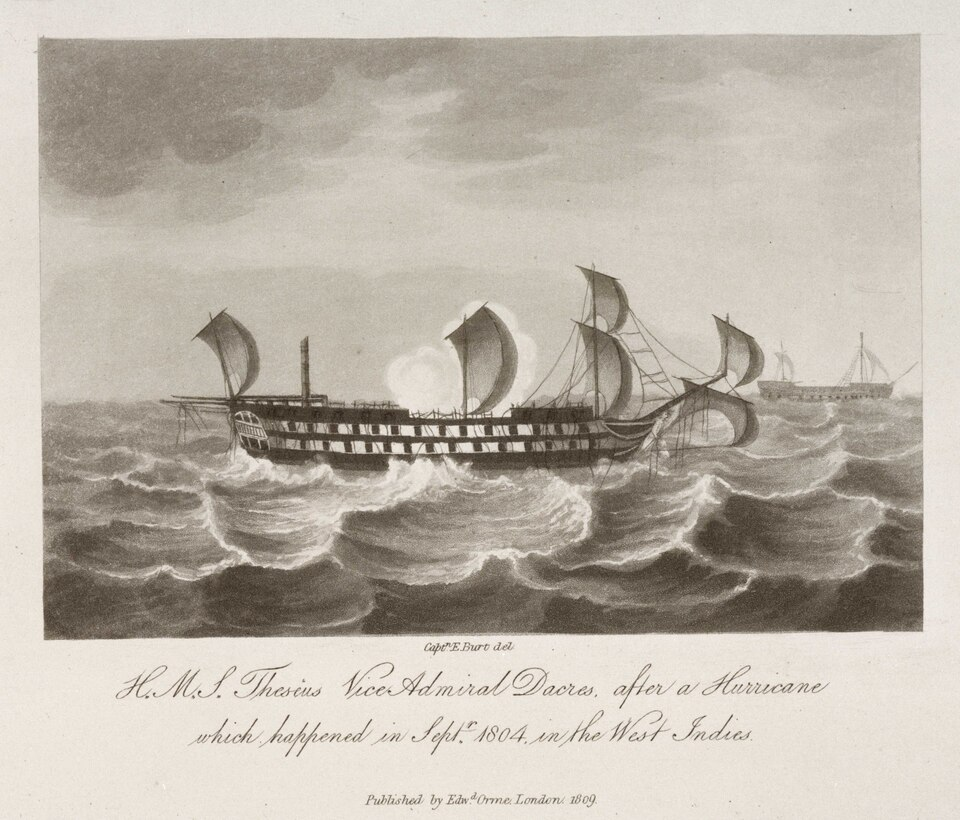

Before this course, I wasn’t very good at estimating the amount of time it would take to complete coding assignments. However, the WODs were very helpful in attuning my sense of time estimation. Usually, when I plan a project or task, I try to estimate more time than I truly think is necessary, so that I have some insurance built in. For this project, I was using Github timing to try to measure the amount of time I would spend on different tasks, although I recognize it’s not the most accurate method.

## The Ship of Theseus

This semester was very busy for me, so sometimes when working on this project I would forget to start the timer to actually measure the amount of time for each task. Measuring the timing of tasks doesn’t come very naturally to me in my daily life. With the WODs, I have decent intuition and don’t really need to time things to the precise minute. I find that it’s better to just get to work on the task. However, time estimates were very helpful for communication with my group-member. I do recognize when I’m not really making any progress though, and usually I try to stop myself before this stage and either ask someone for help or take a break from the task to see if I can think of a solution to try later. Being inefficient is never great, especially when working with other people and I’ve always personally found it important to not be afraid to ask for help. Taking breaks can truly be very helpful. Thinking about something else for a while and coming back refreshed can be the key to thinking of a good solution.

## During the Project

I used the Github clock to track my actual efforts. Sometimes, this was not very accurate because I would take a break and forget to put down the time in the log, so I would forget how long certain tasks took. However, Github gave me a decent enough estimation so I was satisfied with that method.

One thing I definitely underestimated was how difficult it would be to get the Prisma databse in sync with the Vercell deployment. From creating the database itself, I learned early on that I would need to do more research into each of the components that exist, so that I would know exactly what was going on. As the project went on, I was able to get a better estimate of time needed to make sure that any changes I made would also show up on the Vercell deployment.

For a lot of branches that I made, I would set out to do one task which was quite big, and I would get distracted by other tasks that were similar even if I did separate them properly. I personally think my group-member was a lot better at using the branches to delegate smaller tasks. To be honest, I don’t know if I would change this about myself because I personally like getting into a project and working on multiple things at the same time.

## The Time-away (instead of Takeaway, get it?)

After doing this project, I can see the value of tracking effort, especially for something that’s complex and will take a lot of time. I can see that it’s important to plan how long you need to complete a large task. For me, starting timers can be very stressful and I would rather add a few extra hours of time to my estimate just in case. However, I also recognize that you can fall into a trap of inefficiency if you don’t plan well. In the future, I think when I’m about one-thirds done with a task, I need to check in with myself to see how much time has passed, if it’s the amount I expected, and whether I might need a break. There is certainly room for efficiency – even if the big task can’t be broken up, I could still try to split it into thirds or quarters.

I think that the major takeaway here is that communication is important when you’re working in a group. The more that you know about your capabilities with the tasks at hand, the better you will be at communicating what your needs will be to get the job done. However, I do think that there’s no one method of communicating or estimating time. It’s a thing that you have to experience over and over again to be able to ask yourself how you best operate. Everyone always has the opportunity to get better at this sort of thing. Including me! Although, look at the time! I guess I must go now.

> "If there is no struggle, there is no progress."
> - Frederick Douglass
