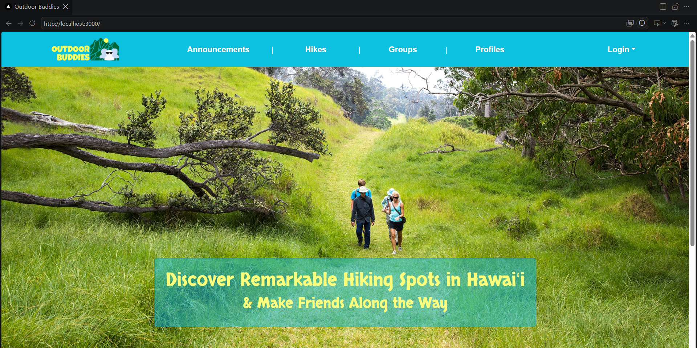
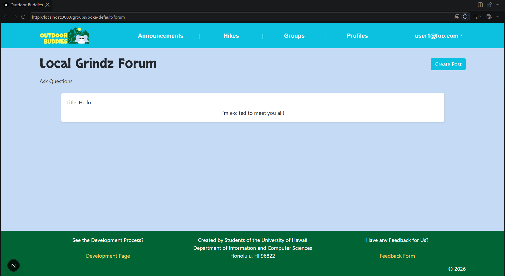

The Outdoor Buddies Landing Page

## Outdoor Buddies - The Premise

My Final Project for ICS 314 was to develop a web application. I was trying to think of the needs of the members in the UH Community, and I remember when I was a student in a new place that I had never lived before. I wasn't sure about what the people did or liked to do in the area; being shy made it difficult for me to make friends. I thought about how there are many outdoors activities that people like to do, tourists and locals alike, and I figured that sometimes these things are better to be done with other people for both safety and socialization.

## My Contributions

I worked on the parts of the website where Users could make their own Profile or Group to be able to say what they were interested in and to meet other people who had the same ideas and goals, respectively. There is a working search function on both pages. Thanks to my group partner for making it initially, but I adjusted it to my pages, as I thought they would be a nice feature. For each group, there's a forum where users can post to ask questions about or request to join the group.

### Profiles Page

### Groups Page

### Groups Forum

## Overall Takeaway

I think it was a nice experience overall. I learned a lot about coding projects, time management, and communication. If I were to do it again, there would be quite a few things I would do differently, but I'm happy with the ending result, as I feel I have put a lot of love into this project.

If you're interested in this project, check our user and developer guide here: [User and Developer Guide](https://outdoor-buddies.github.io/)

If you're interested in checking the web application deployed live through Vercel, check that out here: [Outdoor Buddies Web Application](https://outdoor-buddies-green.vercel.app/)