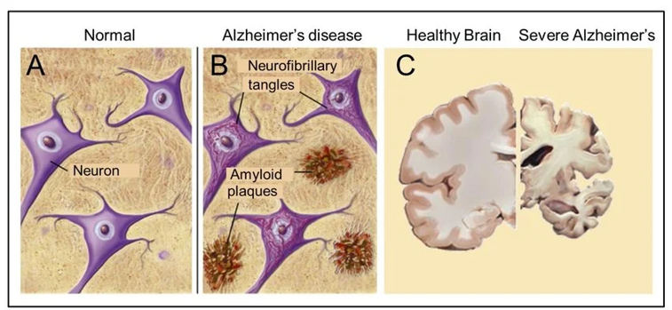
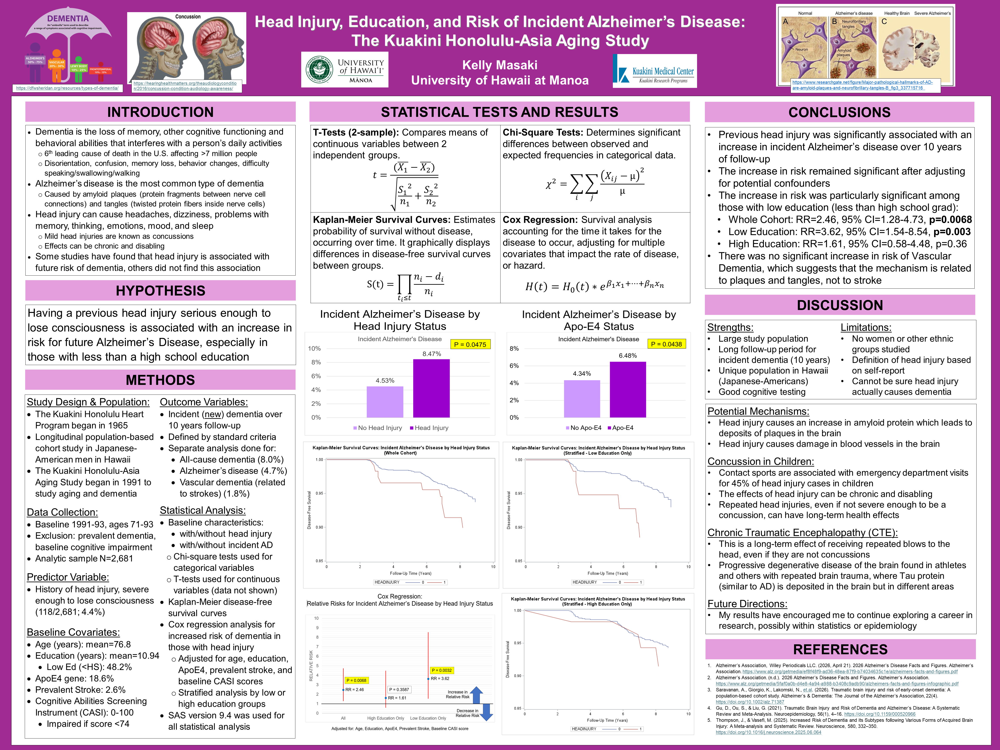

For the Spring 2026 semester, I had to do a math research project for Math 480 I decided to work with Kuakini and the Kuakini Honolulu-Asia Aging Study to present an interdisciplinary math research project.

Below is my poster presentation

